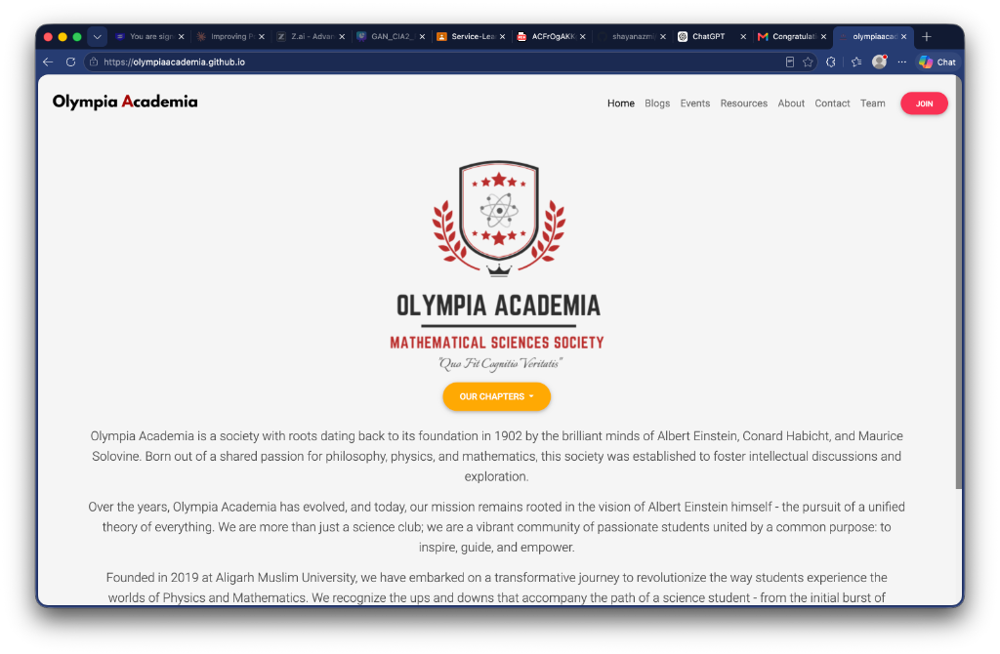
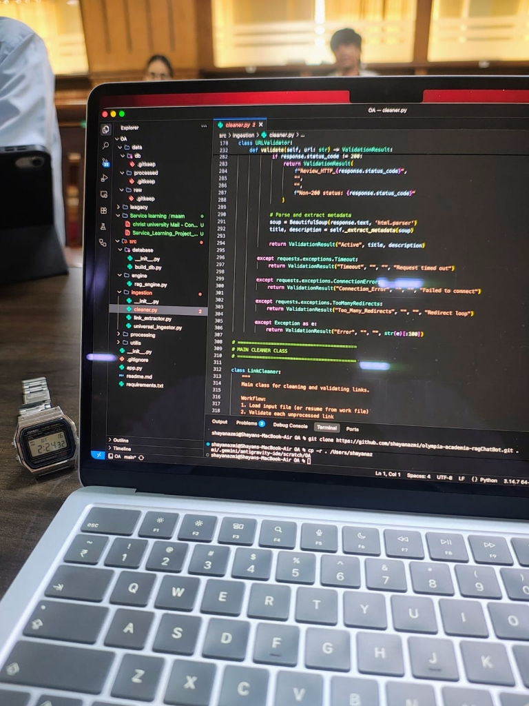

# CHRIST (DEEMED TO BE UNIVERSITY)
## Department of Data Science | School of Sciences
### SERVICE LEARNING PROJECT SYNOPSIS (ACADEMIC YEAR 2026–2027)

---

**Project Title:**  
**Building a Retrieval-Augmented Generation (RAG) Based AI System to Enhance Olympia Academia’s Internal Knowledge Management and Resource Accessibility**

| **Student Details** | **Institutional & Partner Details** |
|---|---|
| **Team Members:** Shayan Azmi (24215224) & Keshav | **Course:** Service Learning (Data Science & AI) |
| **Roles & Division:** Shayan (AI & Pipeline - 60%) \| Keshav (Frontend - 40%) | **Institution:** CHRIST (Deemed to be University) |
| **Email Contact:** shayan.azmi@bscdsaih.christuniversity.in | **Faculty Mentor:** Prof. Neha Saini (neha.saini@christuniversity.in) |
| **Program & Class:** B.Sc. Data Science and AI (Honours) | **Host Organization:** Olympia Academia (Mathematical Sciences Society) |
| **Designation:** AI Developer Interns | **Technical Lead / Mentor:** Mohammad Najeeb (mdnajeeb.cs@gmail.com) |
| **Nature of Project:** Unpaid Community Service-Learning | **Host Website:** [https://olympiaacademia.github.io/](https://olympiaacademia.github.io/) |

---

## Course Learning Outcomes (CLO) Alignment Matrix

| Course Learning Outcome | Project Mapping & Service Learning Application | Section |
|---|---|---|
| **CO1: Understand social responsibility and civic engagement**, enabling students to understand societal challenges and contribute data-driven solutions for sustainable development. | Addresses educational resource fragmentation and accessibility hurdles within an active student science society. Provides an automated solution to preserve and share scientific references, supporting broader access to STEM learning. | Sec. 1.3, 2.3, 6.2 |
| **CO2: Apply data science and artificial intelligence and economics concepts** to address real-world societal problems. | Applies foundational data engineering and AI workflows—including automated ETL, web scraping, data preprocessing, structured database storage, and Retrieval-Augmented Generation (RAG)—to solve organizational knowledge management challenges without software subscription costs. | Sec. 2.2, 4.1, 5.3 |
| **CO3: Understand ethical and responsible use of data and AI**, with awareness of data privacy, bias, fairness, and social impact in real-life applications. | Adheres to ethical guidelines outlined in the internship mandate: enforcing responsible data handling, user privacy awareness during data extraction, bias mitigation in resource retrieval, and fair access across diverse student cohorts. | Sec. 2.2, 4.1, 6.3, 7.3 |

---

## Table of Contents

| Section Title | Page |
|---|:---:|
| **Course Learning Outcomes (CLO) Alignment Matrix** | Page 1 |
| **1. Introduction** | Page 3 |
| &nbsp;&nbsp;&nbsp;&nbsp;1.1 Introduction and Project Title | Page 3 |
| &nbsp;&nbsp;&nbsp;&nbsp;1.2 Background of the Project | Page 3 |
| &nbsp;&nbsp;&nbsp;&nbsp;1.3 Problem / Community Need Statement | Page 3 |
| **2. Purpose and Objectives** | Page 3 |
| &nbsp;&nbsp;&nbsp;&nbsp;2.1 Purpose | Page 3 |
| &nbsp;&nbsp;&nbsp;&nbsp;2.2 Objectives | Page 3 |
| &nbsp;&nbsp;&nbsp;&nbsp;2.3 Expected Learning Outcomes | Page 3 |
| **3. Community Profile** | Page 4 |
| &nbsp;&nbsp;&nbsp;&nbsp;3.1 Target Community / Beneficiaries | Page 4 |
| &nbsp;&nbsp;&nbsp;&nbsp;3.2 Community Needs / Issues | Page 4 |
| **4. Service Learning Methodology** | Page 4 |
| &nbsp;&nbsp;&nbsp;&nbsp;4.1 Proposed Service Activity | Page 4 |
| &nbsp;&nbsp;&nbsp;&nbsp;4.2 Activities / Implementation Plan | Page 4 |
| &nbsp;&nbsp;&nbsp;&nbsp;4.3 Team Roles and Responsibilities (Shayan 60% \| Keshav 40%) | Page 4 |
| &nbsp;&nbsp;&nbsp;&nbsp;4.4 Timeline and Milestones (Team Schedule) | Page 5 |
| **5. Resources and Feasibility** | Page 5 |
| &nbsp;&nbsp;&nbsp;&nbsp;5.1 Human Resources (Team Composition) | Page 5 |
| &nbsp;&nbsp;&nbsp;&nbsp;5.2 Material / Technical Resources | Page 5 |
| &nbsp;&nbsp;&nbsp;&nbsp;5.3 Budget and Financial Feasibility | Page 5 |
| **6. Expected Outcomes and Impact** | Page 5 |
| &nbsp;&nbsp;&nbsp;&nbsp;6.1 Student Learning Outcomes | Page 5 |
| &nbsp;&nbsp;&nbsp;&nbsp;6.2 Community Outcomes | Page 6 |
| &nbsp;&nbsp;&nbsp;&nbsp;6.3 Impact Assessment | Page 6 |
| **7. Documentation and Reflection** | Page 6 |
| &nbsp;&nbsp;&nbsp;&nbsp;7.1 Assessment Method | Page 6 |
| &nbsp;&nbsp;&nbsp;&nbsp;7.2 Beneficiary Feedback | Page 6 |
| &nbsp;&nbsp;&nbsp;&nbsp;7.3 Student Reflection (Collaborative Experience) | Page 6 |
| **8. Future Scope and Sustainability** | Page 6 |
| **9. Conclusion** | Page 6 |
| **10. References** | Page 6 |
| **Annexure I: Selection / Offer Letter (Email Verification Record)** | Page 7 |
| **Annexure II: Community Partner Profile & Digital Portal** | Page 8 |
| **Annexure III: Photographic Record of Student Development** | Page 9 |

---

## 1. Introduction

### 1.1 Introduction and Project Title
The project is titled **"Building a Retrieval-Augmented Generation (RAG) Based AI System to Enhance Olympia Academia’s Internal Knowledge Management and Resource Accessibility"**. This service-learning project is carried out as a collaborative effort by two students from the Department of Data Science at CHRIST (Deemed to be University)—Shayan Azmi and Keshav—following Shayan Azmi's official appointment as an AI Developer Intern with Olympia Academia. Olympia Academia is an academic society dedicated to the mathematical and physical sciences, established in 2019 at Aligarh Muslim University (AMU). The society takes its name and ethos from Albert Einstein's informal reading circle, the 1902 'Akademie Olympia', founded alongside Conrad Habicht and Maurice Solovine to discuss physics, mathematics, and philosophy. The organization supports students through shared study circles, lectures, and open academic discussions.

### 1.2 Background of the Project
Through ongoing activities, members and mentors of Olympia Academia have assembled a substantial collection of academic resources, research papers, lecture recordings, and reference links across their communication networks. Because these resources were shared incrementally over several years across informal group threads, they have become difficult to locate and manage. When students prepare for competitive examinations or research projects, they frequently find it difficult to retrieve specific materials shared in earlier discussions. To resolve this, Olympia Academia initiated a project to develop an internal knowledge management and resource accessibility system using Retrieval-Augmented Generation (RAG).

### 1.3 Problem / Community Need Statement
The society identified three concrete challenges:
1. **Unstructured Information:** Learning materials and references shared over chat platforms are unindexed, resulting in lost resources and repetitive inquiries.
2. **Resource Discovery Friction:** Newer students entering the society cannot readily find curated notes or past workshop materials needed for foundational study.
3. **Need for an Integrated Knowledge System:** Simple keyword searching is insufficient to navigate technical topics. The community needs a reliable, conversational AI retrieval system coupled with a clean user interface that answers student queries accurately while pointing directly to verified sources.

---

## 2. Purpose and Objectives

### 2.1 Purpose
The purpose of this internship project is to apply Data Science and Artificial Intelligence techniques to solve a real-world organizational knowledge management problem, creating a functional RAG-based AI system with an intuitive web frontend that improves resource discovery and accessibility for the Olympia Academia community.

### 2.2 Objectives
The objectives are drawn directly from the official internship role and responsibilities:
1. **Develop an ETL Pipeline:** Build an Extract, Transform, Load pipeline to systematically extract and ingest shared resources from organizational records.
2. **Perform Web Scraping:** Scrape and collect relevant academic information, article text, and educational metadata from approved web sources.
3. **Preprocess and Store Structured Data:** Clean, filter, and structure raw extracted data, storing it in an organized database for efficient querying.
4. **Design and Implement a RAG-Based AI System:** Develop the retrieval and generation architecture to intelligently retrieve and manage shared resources in response to student questions.
5. **Build an Accessible Frontend Interface:** Design and deploy a user-friendly frontend web application enabling students to query the knowledge base and inspect source citations effortlessly.
6. **Engage Stakeholders & Maintain Ethical AI:** Work with organizational mentors to test the system and ensure responsible data handling, user privacy, bias mitigation, and fair access.

### 2.3 Expected Learning Outcomes
The project operationalizes the prescribed Course Learning Outcomes:
- **Social Responsibility (CO1):** Understanding how data-driven tools can reduce information barriers within student study circles and support educational access.
- **Practical Data Science Application (CO2):** Gaining hands-on experience across full-stack data workflows—from data extraction and RAG modeling to user frontend integration.
- **Ethical AI Awareness (CO3):** Putting responsible data stewardship, privacy preservation, and bias mitigation into practice in a community-facing software system.

---

## 3. Community Profile

### 3.1 Target Community / Beneficiaries
- **Primary Beneficiaries:** Student members and peer learners within Olympia Academia actively participating in mathematics and physics study groups.
- **Organizational Stakeholders:** Society mentors, organizers, and Technical Lead Mohammad Najeeb, who curate and oversee academic resources.
- **Secondary Beneficiaries:** Undergraduate students from partner collegiate networks seeking organized, reliable STEM study materials.

### 3.2 Community Needs / Issues
Members currently spend unnecessary time trying to track down past references and lecture links. The society requires an accessible system that enables any student—regardless of technical background—to query the community's collective knowledge repository in natural language and receive prompt, verified references.

---

## 4. Service Learning Methodology

### 4.1 Proposed Service Activity
The proposed service activity involves developing, testing, and deploying an end-to-end Retrieval-Augmented Generation (RAG) knowledge management system for Olympia Academia. The project combines backend data engineering (ETL, scraping, preprocessing, database structuring, RAG modeling) with frontend user interface engineering to provide an intuitive, accessible experience for students.

### 4.2 Activities / Implementation Plan
- **Stage 1 (Weeks 1–2): Scoping & Consultation** — Meet with the technical lead to establish data sources, expected query types, and privacy protocols.
- **Stage 2 (Weeks 3–4): ETL Development & Web Scraping** — Write ingestion scripts to collect shared links, validate destination URLs, and scrape web content.
- **Stage 3 (Weeks 5–6): Data Cleaning & Database Design** — Clean collected text, normalize metadata fields, and organize records in a structured database.
- **Stage 4 (Weeks 6–7): RAG System Implementation** — Construct the retrieval and response workflow, linking query understanding with database records.
- **Stage 5 (Weeks 7–9): Frontend Development & API Integration** — Build the conversational web interface and connect it with the backend RAG engine.
- **Stage 6 (Weeks 9–10): User Testing & Feedback** — Conduct trial sessions with students, refine the UI/UX, and compile final documentation.

### 4.3 Team Roles and Responsibilities (Shayan 60% | Keshav 40%)
To ensure comprehensive execution, the project responsibilities and timeline are structured between two team members:
- **Shayan Azmi (AI Developer & Data Pipeline Lead — 60% Timeline Allocation):**
  1. Designing and implementing the ETL pipeline for resource extraction and ingestion from organizational logs.
  2. Developing web scrapers to extract relevant educational content and metadata while adhering to scraping ethics.
  3. Data preprocessing, text cleaning, normalization, and structured database storage.
  4. Designing and tuning the core Retrieval-Augmented Generation (RAG) search and response engine.
  5. Enforcing backend data privacy and responsible data handling practices.

- **Keshav (Frontend & UI Integration Lead — 40% Timeline Allocation):**
  1. Designing and developing the conversational frontend user interface for student interactions.
  2. Integrating frontend components with backend RAG retrieval endpoints.
  3. Implementing user experience workflows for natural query input, result browsing, and source card displays.
  4. Organizing user testing sessions with Olympia Academia members and gathering structured usability feedback.
  5. Iterating on UI responsiveness and frontend accessibility based on stakeholder feedback.

### 4.4 Timeline and Milestones (Team Schedule)

| Milestone | Timeline | Lead Member | Core Activity | Deliverable |
|---|---|---|---|---|
| **Milestone 1** | Weeks 1–2 | Shayan (Lead) / Keshav | Project Scoping & Requirement Analysis | Requirements Spec |
| **Milestone 2** | Weeks 3–4 | Shayan Azmi (60% Phase) | ETL Pipeline & Web Scraping Engine | Data Extraction Scripts |
| **Milestone 3** | Weeks 5–6 | Shayan Azmi (60% Phase) | Data Preprocessing & Database Storage | Structured Database |
| **Milestone 4** | Weeks 6–7 | Shayan Azmi (60% Phase) | RAG-Based AI Retrieval Engine | Working RAG Core |
| **Milestone 5** | Weeks 7–9 | Keshav (40% Phase) | Frontend UI Development & API Integration | Functioning Web UI |
| **Milestone 6** | Weeks 9–10 | Keshav (Lead) & Shayan | User Testing, Feedback & Final Dossier | Evaluation Report & Dossier |

---

## 5. Resources and Feasibility

### 5.1 Human Resources (Team Composition)
- **Student 1 (AI & Pipeline Lead):** Shayan Azmi (Register No: 24215224), B.Sc. Data Science and AI (Honours) — 60% timeline contribution.
- **Student 2 (Frontend & UI Lead):** Keshav, B.Sc. Data Science and AI (Honours) — 40% timeline contribution.
- **Faculty Mentor:** Prof. Neha Saini, Department of Data Science, Christ University.
- **Host Organization Lead:** Mohammad Najeeb, Technical Lead, Olympia Academia.
- **User Testing Cohort:** 10–15 student members of Olympia Academia participating in evaluation sessions.

### 5.2 Material / Technical Resources
- **Hardware:** Personal development workstations for backend coding, local testing, and frontend UI design.
- **Software Environment:** Python 3.10+ data science ecosystem, web scraping libraries, local database engines, web frontend frameworks, and Git version control.
- **Data Inputs:** Archival resource logs and reference materials provided by Olympia Academia.

### 5.3 Budget and Financial Feasibility
In accordance with the selection letter, this is an unpaid service-learning internship. The project utilizes open-source programming frameworks and local compute resources, requiring no external capital expenditure (₹0 budget). This confirms the financial feasibility of implementing modern data solutions within student-run academic societies.

---

## 6. Expected Outcomes and Impact

### 6.1 Student Learning Outcomes
- **Technical Collaboration (CO2):** Practical experience in dividing full-stack AI development between backend data pipelines and accessible frontend interfaces.
- **Civic Impact (CO1):** Awareness of how technological interventions alleviate information fragmentation within educational communities.
- **Ethical AI Governance (CO3):** Putting responsible data stewardship, user privacy, and bias mitigation into practice.

### 6.2 Community Outcomes
- A consolidated, searchable repository of Olympia Academia's academic materials accessible via a clean web UI.
- Substantial reduction in the time required for students to discover verified study resources.
- Improved continuity of learning as resources remain accessible to future student cohorts.

### 6.3 Impact Assessment
Project impact will be evaluated using two direct criteria: 1) Technical Reliability: Evaluating data extraction coverage and retrieval precision across standard academic query sets; and 2) User Satisfaction: Gathering feedback from Olympia Academia members regarding interface clarity, response speed, and search usefulness.

---

## 7. Documentation and Reflection

### 7.1 Assessment Method
Project progress is documented through weekly milestone updates, regular reviews with Faculty Mentor Prof. Neha Saini, and technical verification by Olympia Academia Technical Lead Mohammad Najeeb leading to the official internship certificate upon completion.

### 7.2 Beneficiary Feedback
Structured feedback will be gathered from community members during testing sessions, focusing on whether retrieved answers correctly address student questions and whether interface navigation is clear.

### 7.3 Student Reflection (Collaborative Experience)
> *"Collaborating on this service-learning project with Olympia Academia has given us practical insight into how data engineering and AI work in a real-world setting. Dividing our efforts—with Shayan focusing on data extraction, ETL pipelines, and the core RAG retrieval engine, and Keshav translating these backend systems into an intuitive, accessible frontend—demonstrated the power of team collaboration. We learned that developing a great AI algorithm is only half the battle; ensuring that non-technical students can interact with it smoothly and ethically is what truly delivers community value."*

---

## 8. Future Scope and Sustainability
Future enhancements include expanding the ingestion pipeline to support additional file formats, establishing automated routines to index newly shared materials continuously, and sharing the knowledge system design with other academic clubs.

---

## 9. Conclusion
By applying data science, Retrieval-Augmented Generation, and clean user interface design to address knowledge management challenges in Olympia Academia, this project provides a tangible, community-focused service. The initiative demonstrates how student developers can apply technical training to strengthen peer learning environments while satisfying academic course learning outcomes.

---

## 10. References
1. Selection Letter: Selection for Olympia Academia AI Developer Intern, Olympia Academia (August 10, 2026).
2. Department of Data Science, CHRIST (Deemed to be University). Service Learning Curriculum Guidelines (CO1, CO2, CO3), 2026–2027.
3. Olympia Academia. Official Portal & Mathematical Sciences Society Constitution, [https://olympiaacademia.github.io/](https://olympiaacademia.github.io/)
4. Lewis, P., et al. (2020). *Retrieval-Augmented Generation for Knowledge-Intensive NLP Tasks.* NeurIPS 2020.
5. UNESCO. (2022). *Recommendation on the Ethics of Artificial Intelligence.* UNESCO Publishing.
6. United Nations. (2015). *Sustainable Development Goals: Goal 4 (Quality Education) & Goal 10 (Reduced Inequalities).*

---

## Annexure I: Selection / Offer Letter (Email Verification Record)

```
RECORD OF OFFICIAL SELECTION EMAIL
Sender: Olympia Academia <olymp.acad@gmail.com>
Date: Monday, August 10, 2026 at 3:31 PM
Subject: Congratulations! Selection for Olympia Academia AI Developer Intern
Recipient: Shayan Azmi <shayan.azmi@bscdsaih.christuniversity.in>
Forwarded to: Prof. Neha Saini <neha.saini@christuniversity.in> (Fri, Aug 14, 2026 at 11:50 AM)

Dear Shayan Azmi,

Congratulations! On behalf of Olympia Academia, this email confirms your selection for the AI 
Developer Intern position.

This internship aligns with service-learning objectives, where technical knowledge in Data Science 
and Artificial Intelligence is applied to address real-world organizational and community 
challenges.

A few important details regarding the internship are outlined below:

Role and Responsibilities:
You will be responsible for building a Retrieval-Augmented Generation (RAG) based AI system to 
enhance Olympia Academia's internal knowledge management and resource accessibility. Your 
responsibilities include:
  • Developing an ETL pipeline for data extraction and ingestion
  • Performing web scraping to gather relevant information
  • Data preprocessing and storing structured data in a database
  • Designing and implementing a RAG-based AI system to intelligently retrieve and manage shared 
resources

This project will involve interaction with organizational stakeholders to understand requirements, 
define project scope, and improve the system based on feedback to ensure meaningful and sustainable 
impact.

You are also expected to follow ethical AI practices, including responsible data handling, privacy 
awareness, bias mitigation, and fairness in AI system development.

Nature of the Internship: This is an unpaid internship.
Extension: The internship may be extended based on project requirements and satisfactory 
performance.
Certificate: An internship certificate will be issued upon satisfactory completion of the assigned 
responsibilities and achievement of project milestones.

Commitment and Professional Expectations:
Interns are expected to demonstrate professionalism, technical proficiency, discipline, and 
consistent engagement throughout the design, development, deployment, and evaluation phases of the 
project. Reflection on challenges and collaborative problem-solving are encouraged.

For any technical guidance or assistance during the project, you may directly contact the Technical 
Lead, Mohammad Najeeb.

Olympia Academia looks forward to welcoming you to the team and to the innovative contributions 
this project will bring in strengthening data-driven knowledge systems and community-focused 
resource accessibility.

Congratulations once again on your selection.

Regards,
Team Olympia Academia
Contact Email: mdnajeeb.cs@gmail.com
Website: https://olympiaacademia.github.io/
```

---

## Annexure II: Community Partner Profile & Digital Portal

  
*Figure 1: Olympia Academia Official Portal ([https://olympiaacademia.github.io/](https://olympiaacademia.github.io/))*

---

## Annexure III: Photographic Record of Student Development

  
*Figure 2: Shayan Azmi actively engineering the data ingestion and ETL pipeline*
